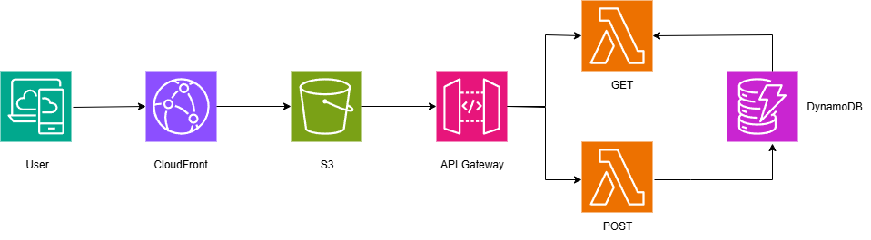

# 🌐 Serverless Web Application on AWS

This project demonstrates how to deploy a fully serverless web application using:

- **Amazon S3** for static web hosting
- **Amazon CloudFront** for global content delivery
- **Amazon API Gateway** for exposing backend APIs
- **AWS Lambda** for backend logic
- **Amazon DynamoDB** for NoSQL database

---

## 📊 Architecture Diagram



---

## 🛠️ Tools & Services Used

| Tool / Service     | Purpose                                         |
|--------------------|-------------------------------------------------|
| **Amazon S3**      | Host static frontend (HTML, CSS, JS)            |
| **Amazon CloudFront** | CDN to distribute S3 content globally         |
| **Amazon API Gateway** | REST API endpoints to access backend logic |
| **AWS Lambda**     | Serverless functions (GET/POST operations)      |
| **Amazon DynamoDB**| NoSQL database to store and retrieve data       |

---

## 🚀 Setup Procedure

### 1. 📁 Hosting Frontend with Amazon S3

1. **Create a bucket**:
   ```bash
   aws s3 mb s3://your-bucket-name
   ```
2.  **Enable static website hosting in the bucket properties.**
3.  **Upload website files:**
   ```bash
   aws s3 sync ./frontend/ s3://your-bucket-name/
   ```
4. Permissions:
* Make the files public or
* Use CloudFront to restrict access securely.

### 2. 🌍 Set Up CloudFront

1. **Create a CloudFront Distribution:**
   * Origin: Your S3 bucket’s static website endpoint
   * Cache settings: Adjust TTL based on update frequency
2. **Optional: Configure a custom domain (Route 53, ACM certificate)**

### 3.  🧩 Configure API Gateway

1. **Create a new REST API.**
2. **Add resources and methods:**
   * ```/items``` → ```GET``` → Lambda Integration
   * ```/items``` → ```POST``` → Lambda Integration
3.**Enable CORS if your frontend is calling these endpoints.**
4. Deploy the API to a stage (e.g., ```/prod```).

### 4. 🧠 Create Lambda Functions

**GET Function (```getItemsFunction```)**
```bash
import boto3
import json

def lambda_handler(event, context):
    dynamodb = boto3.resource('dynamodb')
    table = dynamodb.Table('ItemsTable')
    response = table.scan()
    return {
        'statusCode': 200,
        'body': json.dumps(response['Items'])
    }
```

**POST Function (```postItemsFunction```)**

```bash
import boto3
import json
import uuid
from datetime import datetime

def lambda_handler(event, context):
    dynamodb = boto3.resource('dynamodb')
    table = dynamodb.Table('ItemsTable')
    data = json.loads(event['body'])
    item = {
        'id': str(uuid.uuid4()),
        'name': data['name'],
        'createdAt': datetime.utcnow().isoformat()
    }
    table.put_item(Item=item)
    return {
        'statusCode': 201,
        'body': json.dumps({'message': 'Item created', 'item': item})
    }
```

### 5.🗃️ Create DynamoDB Table

### 🔁 Full Application Flow
1. **User accesses the frontend via CloudFront**
2. **Static site is served from S3**
3. **Frontend sends API requests to API Gateway**
4. **API Gateway triggers Lambda functions**
5. **Lambda reads/writes data from DynamoDB**
6. **Response is sent back to the frontend**

